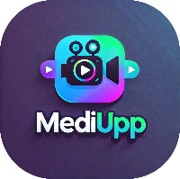

  

# MediUpp: TFG DAW

Proyecto destinado a crear una aplicación web para la gestión de archivos multimedia de eventos de cualquier tipo de temática

## :technologist: Integrantes del grupo

:round_pushpin: Marcos Almorox

:round_pushpin: Sergio Cáceres 

:round_pushpin: Samuel Macias

## :bookmark_tabs: Anteproyecto

[PDF Anteproyecto](./docs/anteproyecto/Anteproyecto_Marcos_Almorox_Sergio_Caceres_Samuel_Macias.pdf)

## :date: Seguimiento de tareas

En este paso seguiremos el proceso de contruccion de nuestro proyecto semana a semana:

  ### :spiral_calendar: - Semana 1: Diseño previo de la página y Estructura de BBDD

  * Diseño basico de la web (Samuel & Sergio)

      - Diseño base --> Realizado con [Figma](https://www.figma.com/es-es/)
      - Paleta de colores --> Realizado con [Coolor](https://coolors.co/20fe7c-e524fa-22dbfa-232323-5a5a5a-919191-ffffff)
    
  * Base de datos relacional (Marcos)

  ### :spiral_calendar: - Semana 2: 

